# SpeakWithMe

**Eye-Tracking AAC System for Nonverbal Hospital Patients**

[](https://python.org)
[](https://react.dev)
[](https://fastapi.tiangolo.com)
[](https://www.typescriptlang.org)
[](https://sqlite.org)
[](https://tailwindcss.com)
[](LICENSE)

---

## About

SpeakWithMe is a real-time eye-tracking communication system that gives nonverbal hospital patients a voice. Patients who cannot speak or use their hands — due to stroke, ALS, post-intubation recovery, or other conditions — can navigate a structured medical decision tree using only their eye gaze. When they reach a destination, an Anthropic Claude LLM generates a clear, first-person clinical statement ("I have severe burning pain in my chest that started hours ago") which the attending doctor reads immediately.

The system works entirely through a standard laptop webcam — no specialized gaze hardware required. MediaPipe FaceMesh tracks iris position at ~30fps, a calibration step maps each patient's gaze to screen zones, and dwell-based selection (holding gaze for 3 seconds) triggers navigation. The result is a complete communication loop from eye movement to spoken and written medical statement, all running in a browser.

This is a bachelor's thesis project in Computer Science, combining real-time computer vision, large language model integration, and a three-layer GDPR-compliant security architecture into a working clinical prototype.

---

## Key Features

👁️ **Real-time eye tracking** — MediaPipe FaceMesh detects iris landmarks through any standard webcam. No specialized hardware needed. A 5-point calibration maps each patient's gaze to the screen.

🗣️ **AI-powered communication** — Anthropic Claude (`claude-sonnet-4-20250514`) converts the patient's selected decision path into a fluent, first-person clinical statement. The statement is also spoken aloud via the Web Speech API.

🌳 **Structured medical decision tree** — Four top-level categories (Assistance, Needs, Pain, Communication) with up to six navigation levels. The Pain branch guides patients through body region → specific symptom → severity → pain type → duration → persistence.

🔒 **Three-layer security architecture** — AES-256-GCM encryption at rest for all session data, a SHA-256 hash-chain audit trail for tamper evidence, and a full GDPR data lifecycle module (auto-purge, right to erasure, data portability, anonymization).

👨‍⚕️ **Doctor dashboard** — Secure login with account registration. Patient management with full session history, inline notes editor, and session counts. Built-in PDF report generation per patient.

🆘 **Emergency alert system** — One-click (or double-Escape) emergency button triggers a 880Hz audio alarm, fullscreen red overlay, and immediate audit log entry.

⏱️ **Dwell-based selection** — Configurable gaze hold duration (default 3 seconds) with a visual progress ring. Eyes-closed for 3 seconds automatically navigates back. Center gaze cancels the current dwell.

📝 **Doctor registration** — Self-service account creation with password strength validation (min 8 characters, uppercase, digit). Usernames are unique; no admin bootstrapping required.

📄 **PDF patient reports** — Downloadable per-patient PDF with full profile, notes, and complete session history in chronological order with timezone-correct timestamps.

🕐 **Timezone-aware timestamps** — All data is stored in UTC and displayed in Europe/Bucharest time (configurable). Handles both legacy and new record formats transparently.

---

## Screenshots

> Screenshots are located in the [`screenshots/`](screenshots/) directory.

| | |
|---|---|
| 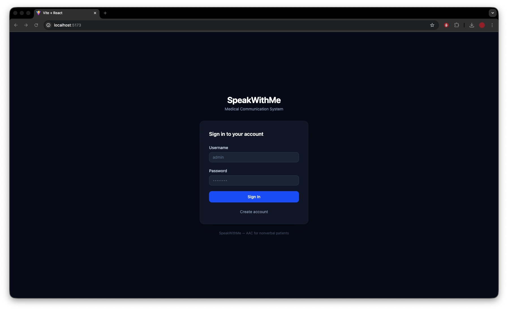 | 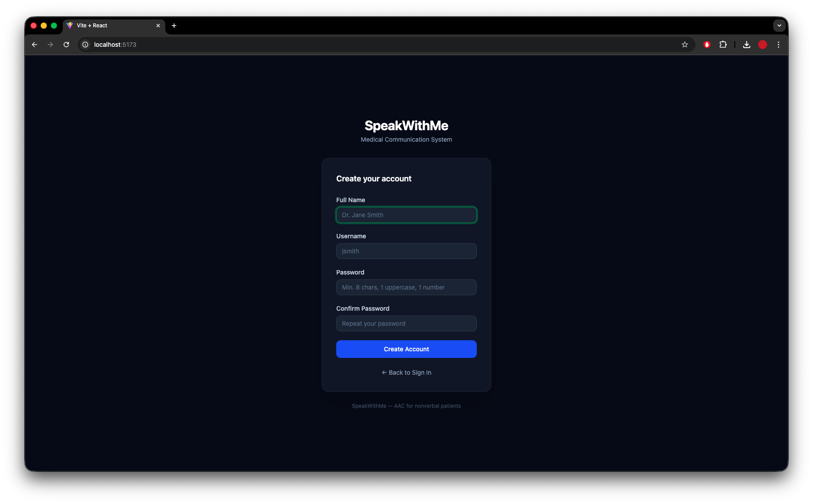 |
| *Login — with "Create Account" link* | *Doctor registration form* |
| 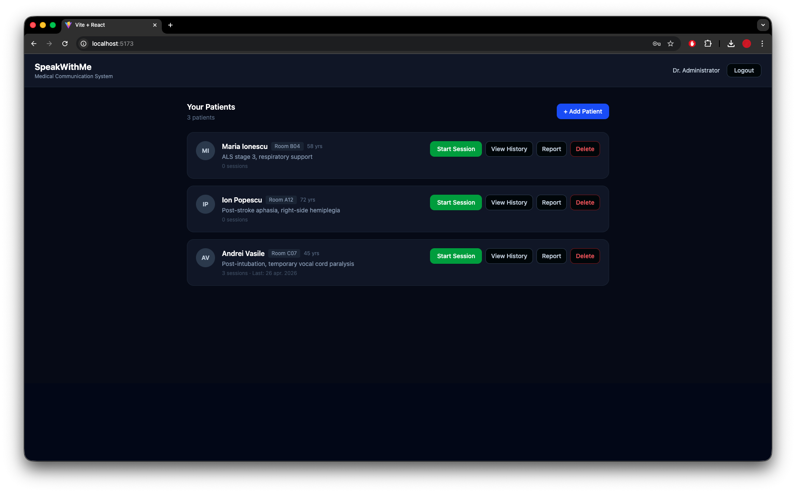 | 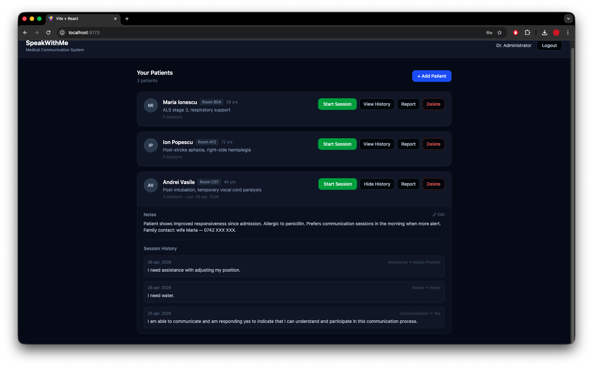 |
| *Patient dashboard with session counts* | *Expanded patient — notes editor + session history* |
| 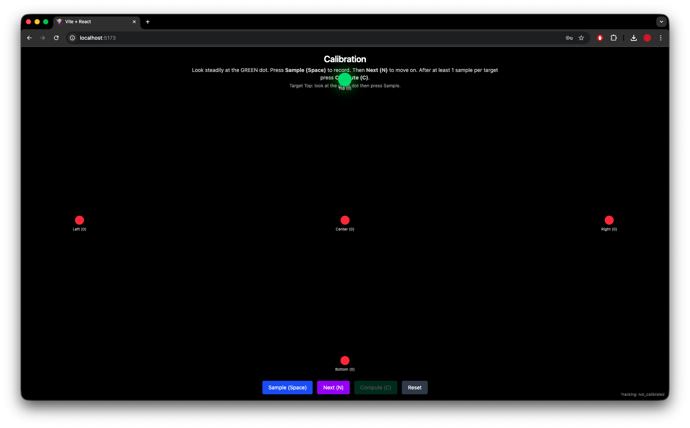 | 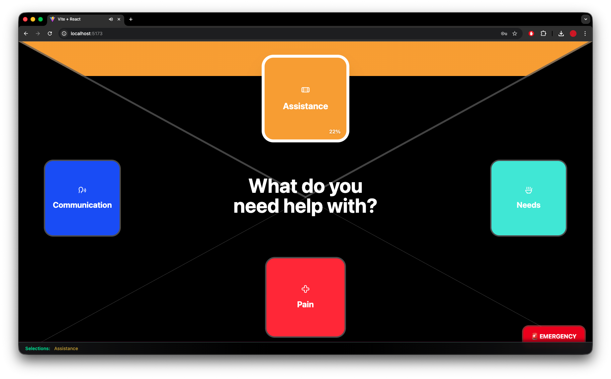 |
| *5-point gaze calibration* | *Main session UI — 4-zone eye tracking interface* |
| 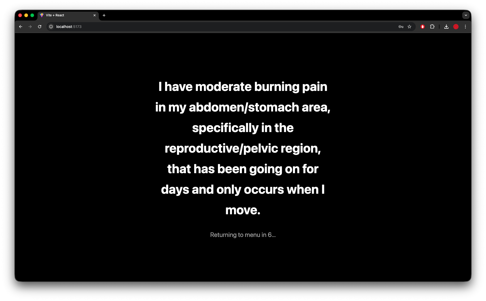 | 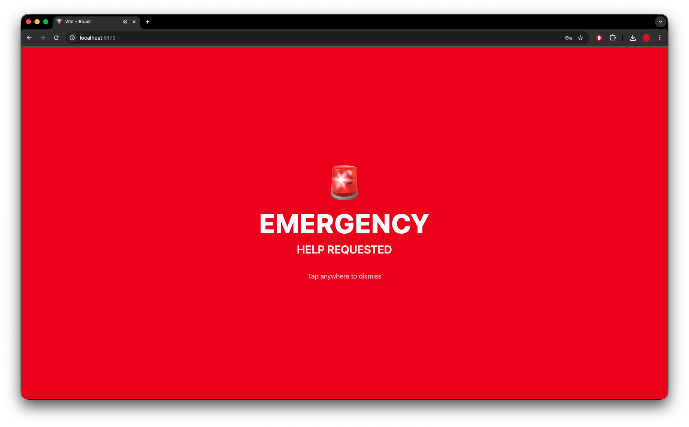 |
| *LLM-generated first-person summary + TTS* | *Emergency alert — fullscreen red overlay* |
| 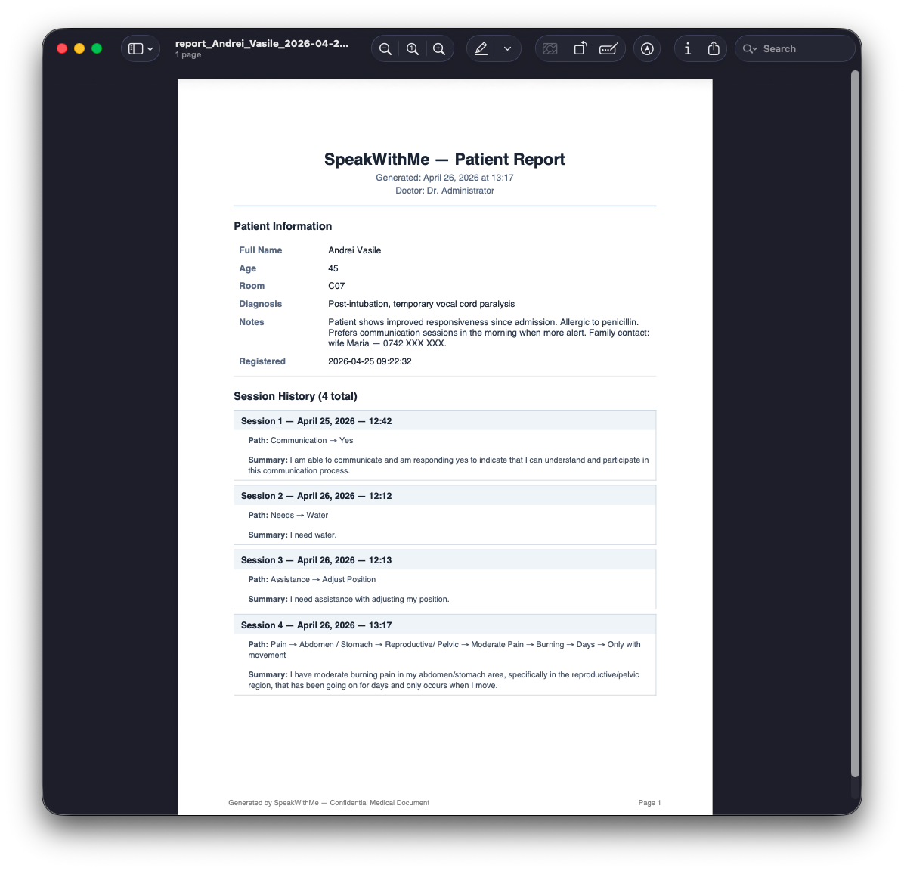 | 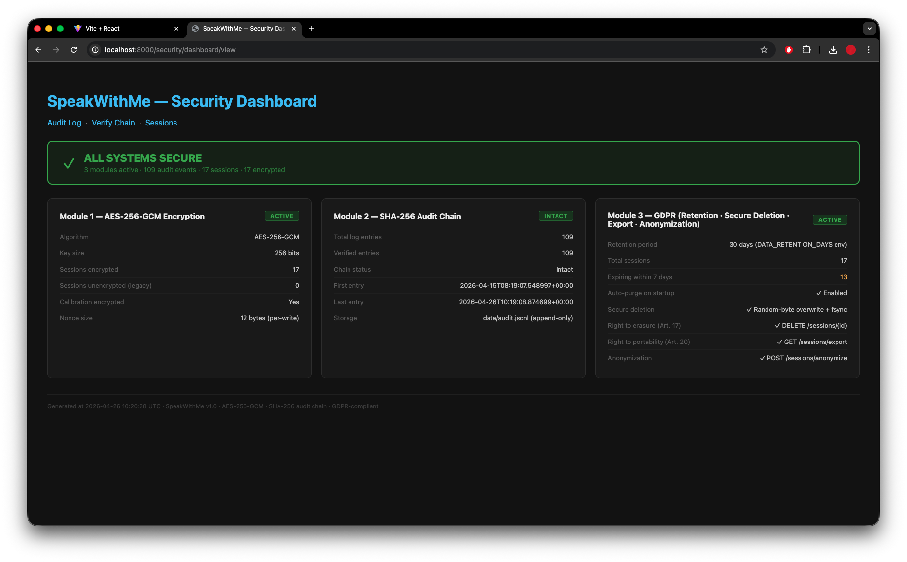 |
| *Downloaded patient PDF report* | *Security status dashboard* |

---

## System Architecture

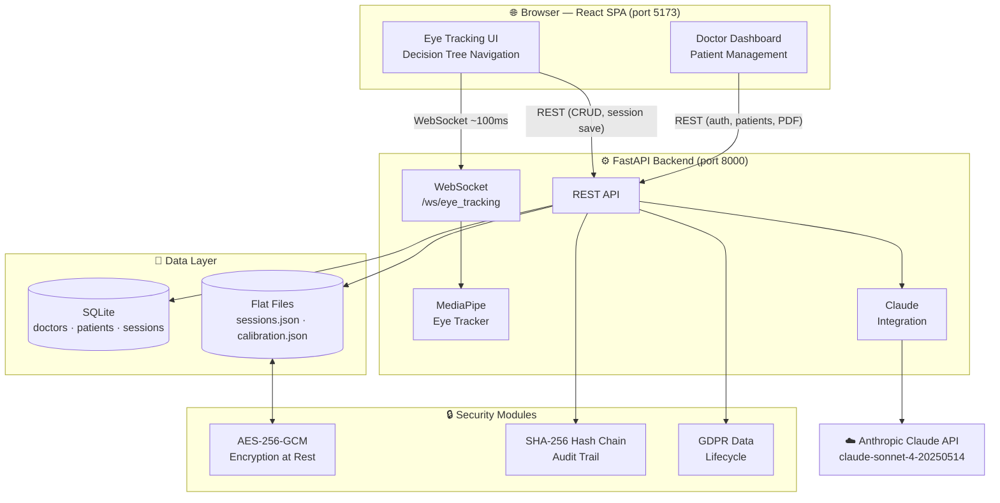

**Typical session data flow:**
1. Doctor opens Dashboard → selects patient → clicks Start Session
2. Frontend connects WebSocket; backend streams `hover_zone` updates every ~100ms
3. Patient dwells on a zone for 3s → selection confirmed → tree advances
4. At the leaf node, frontend POSTs the path to `/get_llm_summary`
5. Backend calls Anthropic API → returns first-person statement
6. Frontend speaks the statement aloud (Web Speech API) and displays it for 10s
7. Session is saved to SQLite; audit log entry appended with SHA-256 hash

---

## Tech Stack

| Layer | Technology |
|-------|-----------|
| **Frontend framework** | React 19.1.1, TypeScript (strict) |
| **Build tooling** | Vite 7.1.2, `@vitejs/plugin-react` |
| **Styling** | Tailwind CSS v4, shadcn/ui (Radix UI primitives) |
| **Icons** | Lucide React 0.542.0 |
| **Frontend state** | React Context + `useReducer` (no Redux/Zustand) |
| **Backend framework** | Python 3.11.9, FastAPI ≥ 0.116.1 |
| **ASGI server** | Uvicorn ≥ 0.30.0 |
| **Eye tracking** | MediaPipe ≥ 0.10.21, OpenCV ≥ 4.11.0.86 |
| **AI / LLM** | Anthropic SDK ≥ 0.40.0 (`claude-sonnet-4-20250514`) |
| **Database** | SQLite (Python built-in `sqlite3`, no ORM) |
| **Encryption** | `cryptography` ≥ 44.0.0 — AES-256-GCM via `AESGCM` |
| **PDF generation** | ReportLab ≥ 4.0 (Platypus) |
| **Package manager** | `uv` (backend), `npm` (frontend) |

---

## Project Structure

<details>
<summary>Expand directory tree</summary>

```
SpeakWithMe/
├── README.md
├── backend/
│   ├── main.py                  ← FastAPI app — all endpoints + eye tracking logic
│   ├── database.py              ← SQLite CRUD (doctors, patients, sessions)
│   ├── auth.py                  ← In-memory token store (24h TTL)
│   ├── pyproject.toml           ← Python 3.11.9 + 9 dependencies (uv-managed)
│   ├── .env                     ← ANTHROPIC_API_KEY, ENCRYPTION_KEY (git-ignored)
│   ├── security/
│   │   ├── encryption.py        ← AES-256-GCM at rest (per-record nonces)
│   │   ├── audit.py             ← SHA-256 hash-chain audit trail
│   │   └── data_retention.py    ← GDPR lifecycle (purge, erasure, export, anonymize)
│   └── data/
│       ├── speakwithme.db       ← SQLite database
│       ├── sessions.json        ← Encrypted flat-file session records
│       ├── calibration.json     ← Encrypted gaze calibration weights
│       └── audit.jsonl          ← Append-only audit trail (hash-chained)
└── frontend/
    ├── src/
    │   ├── App.tsx              ← Root router (login / dashboard / session)
    │   ├── options.tsx          ← DECISION_TREE data structure + icon map
    │   ├── components/
    │   │   ├── LoginPage.tsx    ← Doctor login form
    │   │   ├── RegisterPage.tsx ← Doctor registration form
    │   │   ├── Dashboard.tsx    ← Patient list, notes editor, session history
    │   │   ├── CalibrationPage.tsx ← 5-target gaze calibration UI
    │   │   ├── TriangleZone.tsx ← Cardinal gaze zone with dwell progress ring
    │   │   ├── SelectionTerminalBar.tsx ← Path breadcrumb bar
    │   │   ├── EmergencyButton.tsx ← Emergency trigger + fullscreen overlay
    │   │   └── SummaryModal.tsx ← LLM result display with 10s countdown
    │   ├── state/
    │   │   ├── AppContext.tsx   ← Provider, hooks, commitSelection()
    │   │   ├── appReducer.ts   ← Reducer + initialAppState()
    │   │   ├── appTypes.ts     ← AppState, AppAction, EyeStatus types
    │   │   ├── useDwellController.ts ← Dwell timer hook
    │   │   └── useGazeOrchestration.ts ← Gaze → zone mapping hook
    │   └── lib/
    │       ├── api.ts          ← fetch wrapper (API_BASE, typed api() helper)
    │       └── useEyeTracking.ts ← WebSocket hook for gaze state
    ├── package.json
    └── vite.config.ts
```

</details>

---

## Getting Started

### Prerequisites

- Python 3.11+ and [`uv`](https://docs.astral.sh/uv/getting-started/installation/)
- Node.js 18+ and npm
- An [Anthropic API key](https://console.anthropic.com/)
- A webcam (built-in or external)

### Installation

```bash
# 1. Clone the repository
git clone https://github.com/RosuDaniel23/SpeakWithMe.git
cd SpeakWithMe
```

**Backend:**
```bash
cd backend

# Install Python dependencies
uv sync

# Create environment file
cp .env.example .env
# Edit .env and set your ANTHROPIC_API_KEY
# ENCRYPTION_KEY is auto-generated on first run if not set
```

**Frontend:**
```bash
cd frontend
npm install
```

### Running

Open two terminals:

```bash
# Terminal 1 — Backend (from /backend)
uv run uvicorn main:app --host 0.0.0.0 --port 8000 --reload
```

```bash
# Terminal 2 — Frontend (from /frontend)
npm run dev
# → http://localhost:5173
```

### Default Credentials

```
Username: admin
Password: admin123
```

> **Note:** `ENCRYPTION_KEY` is auto-generated and written to `.env` on first run. All session data and calibration weights are encrypted with this key — back it up if you need to read existing records after re-deployment.

---

## How It Works

### The Doctor's Workflow

1. **Login or create an account** at the login page. Password requirements are enforced at registration (min 8 characters, at least one uppercase letter and one digit).
2. **Add a patient** from the dashboard — enter name, age, room number, and diagnosis.
3. **Start a session** by clicking the session button on any patient card. This opens the full-screen eye-tracking interface linked to that patient's record.

### The Patient's Communication Session

4. **Calibration** — The system prompts the patient to look at 5 targets (top, bottom, left, right, center). A linear regression model fits iris position to screen zones. Existing calibration is reused across sessions.
5. **Navigation** — Four zones fill the screen (top, bottom, left, right) showing the current decision tree options. The patient looks at a zone to start the dwell timer.
6. **Selection** — Holding gaze on a zone for 3 seconds (shown by a filling progress ring) selects that option and advances the tree. Looking away or toward the center cancels the dwell. Eyes-closed for 3 seconds navigates back one level.
7. **Leaf node reached** — The selected path (e.g., `Pain → Head/Neck → Headache → Severe → Sharp → Hours → Constant`) is sent to the backend.
8. **AI summary** — Claude generates a first-person clinical statement: *"I have severe, sharp pain in my head that has been constant for hours."* The statement is spoken aloud via the Web Speech API and displayed for 10 seconds before the interface auto-resets.
9. **Session saved** — The path and summary are stored in SQLite linked to the patient record.

### The Doctor Reviews

10. **Session history** — The dashboard shows all sessions per patient with timestamps (Europe/Bucharest timezone). Notes can be added or edited inline.
11. **PDF report** — Download a formatted patient report including profile, notes, and complete session history in chronological order.

---

## Security Architecture

SpeakWithMe implements three independent security modules as part of its GDPR-compliant design:

### Module 1 — Encryption at Rest (AES-256-GCM)

All sensitive fields (session summaries, navigation paths, calibration weights) are encrypted before writing to disk. Each record uses a freshly generated 12-byte random nonce — identical plaintexts produce different ciphertexts. The encryption key (`ENCRYPTION_KEY`) is a 32-byte key stored in `.env` and auto-generated on first run.

Unencrypted legacy records are transparently migrated on server startup. The encryption status of each data file is visible at `GET /security/encryption-status`.

### Module 2 — SHA-256 Hash Chain Audit Trail

Every security-relevant event (login, session save, LLM summary, emergency, registration, calibration, GDPR operations) is appended to `data/audit.jsonl`. Each entry includes: UTC timestamp, action type, sanitized details (no patient medical content), source IP, previous entry hash, and its own SHA-256 hash computed over all of the above.

This creates a tamper-evident chain: any modification to a past entry invalidates all subsequent hashes. Verification is available at `GET /security/verify-chain` (JSON) or `GET /security/verify-chain/view` (HTML).

### Module 3 — GDPR Data Lifecycle

| Right | Implementation |
|-------|---------------|
| Storage limitation (Art. 5.1.e) | Auto-purge sessions older than `DATA_RETENTION_DAYS` (default: 30) on startup |
| Right to erasure (Art. 17) | `DELETE /sessions` (all) and `DELETE /sessions/{id}` — secure overwrite with random bytes before deletion |
| Data portability (Art. 20) | `GET /sessions/export` — decrypted JSON with GDPR metadata |
| Anonymization | `POST /sessions/anonymize` — replaces content with `[ANONYMIZED]`, re-encrypts, preserves structure for analytics |

The security dashboard is accessible at `http://localhost:8000/security/dashboard/view`.

---

## Decision Tree Structure

```
Main Menu
├── 🤝 Assistance
│   ├── EMERGENCY CALL
│   ├── Adjust Position
│   ├── Bathroom Assistance
│   └── Need Nurse (non-critical)
│
├── 💧 Needs
│   ├── Water
│   ├── Food
│   ├── Wheelchair
│   └── More Needs
│
├── 🔴 Pain                          ← up to 6 levels deep
│   ├── Head / Neck
│   │   ├── Headache / Migraine ─────┐
│   │   ├── Ears / Hearing           │
│   │   ├── Throat / Mouth           │  → Pain Level (None/Mild/Moderate/Severe)
│   │   └── Vision / Eyes            │       → Pain Type (Sharp/Dull/Burning/Throbbing)
│   ├── Chest / Lungs                │            → Duration (Minutes/Hours/Days/Weeks)
│   │   ├── Breathing                │                 → Persistence (Constant/Comes & Goes/…)
│   │   ├── Heart / Chest Pain       │                      → 🤖 AI Summary Generated
│   │   ├── Weakness / Fatigue  ─────┘
│   │   └── Cough & Mucus
│   ├── Abdomen / Stomach
│   │   ├── Digestive Issues
│   │   ├── Urinary / Kidneys
│   │   ├── Reproductive / Pelvic
│   │   └── Pain / Discomfort
│   └── Arms / Legs
│       ├── Joints
│       ├── Mobility
│       ├── Numbness
│       └── Inflammation
│
└── 💬 Communication
    ├── Yes
    ├── I Don't Know
    ├── No
    └── Repeat
```

---

## API Reference

> FastAPI auto-generates interactive docs at **[http://localhost:8000/docs](http://localhost:8000/docs)**

<details>
<summary>Expand full API reference</summary>

### Authentication

| Method | Path | Auth | Description |
|--------|------|------|-------------|
| `POST` | `/auth/register` | No | Create new doctor account — `{username, full_name, password}` → 201 |
| `POST` | `/auth/login` | No | `{username, password}` → token + doctor info + sets httpOnly cookie |
| `POST` | `/auth/logout` | No | Invalidate token, clear cookie |
| `GET` | `/auth/me` | Yes | Current authenticated doctor info |

### Patient Management

| Method | Path | Auth | Description |
|--------|------|------|-------------|
| `GET` | `/api/patients` | Yes | List doctor's patients with session count and last session date |
| `POST` | `/api/patients` | Yes | Create patient — returns 201 + created record |
| `GET` | `/api/patients/{id}` | Yes | Patient details + full session history |
| `PUT` | `/api/patients/{id}` | Yes | Update patient fields (partial update) |
| `DELETE` | `/api/patients/{id}` | Yes | Delete patient and cascade sessions |
| `POST` | `/api/patients/{id}/start-session` | Yes | Begin a linked eye-tracking session |
| `GET` | `/api/patients/{id}/report` | Yes | Download PDF patient report |
| `GET` | `/api/patients/{id}/sessions` | Yes | SQLite sessions for this patient |

### Eye Tracking & Calibration

| Method | Path | Auth | Description |
|--------|------|------|-------------|
| `GET` | `/eye_tracking` | No | Current gaze state (hover_zone, calibrated, eyes_closed) |
| `WebSocket` | `/ws/eye_tracking` | No | Real-time gaze state push (~100ms interval) |
| `POST` | `/calibration/start` | No | Begin calibration (`?force=true` to force recalibrate) |
| `POST` | `/calibration/target` | No | Set active calibration point `{target_index: 0..4}` |
| `POST` | `/calibration/sample` | No | Capture one gaze sample for the current target |
| `POST` | `/calibration/compute` | No | Fit regression; returns quality label + RMSE |
| `GET` | `/calibration/status` | No | Current calibration progress |

### Sessions & LLM

| Method | Path | Auth | Description |
|--------|------|------|-------------|
| `POST` | `/get_llm_summary` | No (token optional) | Generate AI summary; if token + patient_id, saves to SQLite |
| `POST` | `/emergency` | No | Log emergency event to audit trail |
| `GET` | `/sessions` | No | Retrieve all flat-file sessions (decrypted) |
| `GET` | `/sessions/export` | No | GDPR Article 20 data export with metadata |
| `POST` | `/sessions/anonymize` | No | Anonymize session content in place |
| `DELETE` | `/sessions` | No | Securely delete all sessions |
| `DELETE` | `/sessions/{id}` | No | Securely delete single session |

### Security & Monitoring

| Method | Path | Auth | Description |
|--------|------|------|-------------|
| `GET` | `/security/encryption-status` | No | Encryption config + per-file statistics |
| `GET` | `/security/audit-log` | No | Last N audit events (JSON) |
| `GET` | `/security/audit-log/view` | No | Color-coded audit trail (HTML) |
| `GET` | `/security/verify-chain` | No | SHA-256 chain verification (JSON) |
| `GET` | `/security/verify-chain/view` | No | Chain verification results (HTML) |
| `GET` | `/security/dashboard/view` | No | Security status overview (HTML) |
| `GET` | `/health` | No | Server health check |

</details>

---

## Environment Variables

| Variable | Required | Default | Description |
|----------|----------|---------|-------------|
| `ANTHROPIC_API_KEY` | **Yes** | — | Anthropic API key for Claude LLM summaries |
| `ENCRYPTION_KEY` | No | Auto-generated | 64-char hex string (32-byte AES-256 key). Written to `.env` on first run. |
| `DB_FILE` | No | `data/speakwithme.db` | Path to SQLite database file |
| `SESSIONS_FILE` | No | `data/sessions.json` | Path to flat-file session store |
| `CALIBRATION_FILE` | No | `data/calibration.json` | Path to calibration weights file |
| `AUDIT_FILE` | No | `data/audit.jsonl` | Path to audit trail file |
| `DATA_RETENTION_DAYS` | No | `30` | Days before sessions are auto-purged |
| `ALLOWED_ORIGINS` | No | `http://localhost:5173,http://localhost:3000` | Comma-separated CORS allowed origins |
| `LLM_MODEL` | No | `claude-sonnet-4-20250514` | Anthropic model ID for summaries |
| `VITE_API_URL` | No | `http://localhost:8000` | Backend URL for the frontend build |

---

## Thesis Project

This system was developed as a **bachelor's thesis in Computer Science** at **Technical University of Cluj-Napoca**.

### Academic Contributions

**Real-time eye tracking with commodity hardware** — The gaze tracking pipeline is built from first principles using MediaPipe FaceMesh landmarks and per-patient linear regression calibration. No commercial eye-tracking SDK or specialized hardware is used, making the system deployable on any hospital laptop with a built-in webcam.

**LLM integration for medical AAC** — Rather than fixed, pre-written responses, the system uses a large language model to generate contextually appropriate clinical statements from structured gaze-path data. This produces natural, first-person phrasing ("I have...") rather than telegraphic output, improving doctor comprehension and patient dignity.

**Security-first design** — All three security modules are implemented at the cryptographic primitive level: AEAD encryption (not a higher-level ORM or framework feature), a manually constructed SHA-256 hash chain (not an off-the-shelf audit library), and GDPR lifecycle operations with OS-level file overwriting. The implementation is intentionally transparent for academic inspection.

**Complete working prototype** — The system runs end-to-end on a single developer machine, from webcam input through eye tracking, decision tree navigation, LLM generation, session persistence, and doctor review — with no external dependencies beyond an Anthropic API key.

**Thesis advisor:** Prof. Roxana Rusu Both  
**University:** Technical University of Cluj-Napoca  
**Academic year:** 2025–2026

---

## Future Work

- [ ] Production-ready authentication (JWT with refresh tokens, persistent session storage)
- [ ] Time-To-Open (TTO) prediction — predict the patient's intended selection before dwell completes to reduce communication latency
- [ ] Advanced calibration (polynomial or neural-network regression for improved accuracy with glasses and varied lighting)
- [ ] Multi-language support for decision tree labels and LLM prompts
- [ ] Mobile and tablet support (touch-based dwell simulation for family caregivers)
- [ ] Hospital EHR/EMR integration (HL7 FHIR export of session summaries)
- [ ] Real-time doctor notifications (WebSocket push when patient completes a session)
- [ ] Session analytics and progress tracking (communication frequency, preferred categories, response time trends)
- [ ] HTTPS / TLS termination for production deployment
- [ ] Encrypted key rotation without data loss

---


## Acknowledgments

- **Thesis advisor:** Prof. Roxana Rusu Both — Technical University of Cluj-Napoca
- **Technical University of Cluj-Napoca** — Faculty of Automation and Computer Science
- **[Anthropic](https://anthropic.com)** — Claude API for AI-generated medical summaries
- **[Google MediaPipe](https://mediapipe.dev)** — FaceMesh landmark detection
- **[shadcn/ui](https://ui.shadcn.com)** — React component library

---

<p align="center">
  <sub>Built with care for patients who need it most.</sub>
</p>
